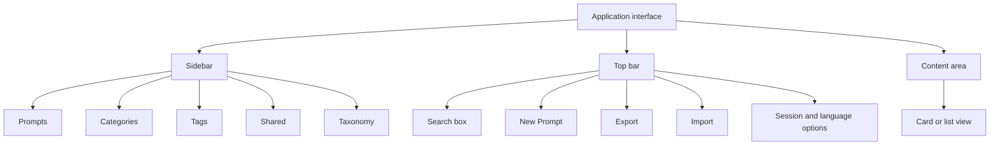
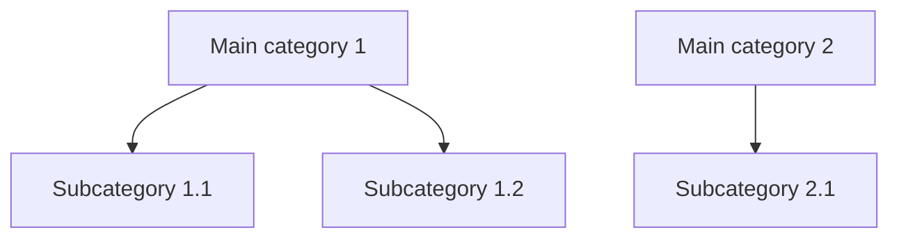

# User Manual — Prompt Library

> Web application for managing and organising prompts for artificial intelligence.
> Former name: «Prompt Database».
> Creation date: 7 August 2026.

---

## Table of contents

1. [Part 1. Introduction](#part-1-introduction)
2. [Part 2. Getting started](#part-2-getting-started)
3. [Part 3. Managing prompts](#part-3-managing-prompts)
4. [Part 4. Organisation](#part-4-organisation)
5. [Part 5. Search and filters](#part-5-search-and-filters)
6. [Part 6. JSON export and import](#part-6-json-export-and-import)
7. [Part 7. Profile and preferences](#part-7-profile-and-preferences)
8. [Part 8. Administration](#part-8-administration)
9. [Part 9. Frequently asked questions](#part-9-frequently-asked-questions)
10. [Creation date and version note](#creation-date-and-version-note)

---

## Part 1. Introduction

### 1.1 What the application is

- Prompt Library (formerly «Prompt Database») is a web application for managing and organising prompts for artificial intelligence.
- It allows you to create, edit, delete, search and classify prompts from your browser, with no local installation.
- Each prompt is stored with a title, a description, its content and organisational metadata.
- The application tracks the usage of each prompt: usage count and last used date.
- Each user has their own space: prompts are isolated per user.

### 1.2 What it is for

| Need | Solution provided by the application |
|---|---|
| Reusing prompts | Copy to clipboard with one click |
| Finding prompts | Full-text search and filters |
| Organising content | Hierarchical categories and tags |
| Sharing work | Shared prompts with read-only access for other users |
| Backing up and restoring data | Export and import in JSON format |

### 1.3 Who it is for

- People who use artificial intelligence tools and want to save, organise and reuse their prompts.
- Teams working with a shared pool of prompts: the application requires a user account and keeps each account's content separate.
- Administrators: they manage user accounts (create, activate, deactivate and delete).

### 1.4 Technology and deployment

- The application runs in production through the browser: deployed on Vercel with a PostgreSQL database on Neon.
- There is no local environment: nothing needs to be installed on your computer.
- Application technology (reference):

| Component | Technology |
|---|---|
| Framework | Next.js 14 (App Router) |
| Programming language | TypeScript |
| Database access | Prisma |
| Database | PostgreSQL |
| User interface | TailwindCSS and shadcn/ui |

- Interface languages: Spanish and English.

---

## Part 2. Getting started

### 2.1 Accessing the application

- Open your browser.
- Enter the application address provided by the service administrator (the production deployment is hosted on Vercel).
- The application requires no installation or prior configuration.

### 2.2 Creating an account and signing in

- Without an active session, the top bar shows the «Sign In» and «Sign Up» options.
- Sign up:
  - Click «Sign Up».
  - Complete the fields: name, email and password.
  - The password must be at least 6 characters long.
  - Click «Sign Up» to create the account.
- Sign in:
  - Click «Sign In».
  - Enter your email and password.
  - Click «Sign In».
- After several failed attempts, the application may show the «Too many attempts» notice and temporarily lock access; wait and try again later.

### 2.3 First look at the interface

- Sidebar: navigation between Prompts, Categories, Tags, Shared and Taxonomy; it can be collapsed and expanded.
- Top bar: search box, «New Prompt» button, «Export», «Import» and session and language options.
- Content area: prompts in card or list view, with the active filters applied.
- The visible columns of the list and the cards are configured in the profile (see Part 7).

### 2.4 Interface language

- The application offers Spanish and English.
- The selection is made from the user profile (see Part 7).
- The «Automatic (browser)» option uses the language configured in the browser.

---

## Part 3. Managing prompts

### 3.1 Creating a prompt

- Click «New Prompt» in the top bar.
- Complete the required fields:
  - Title.
  - Prompt content.
- Fill in the optional fields: description, pre-prompt, usage manual, metadata and advanced section.
- Click «Save».

### 3.2 Form fields

| Section | Field | Description |
|---|---|---|
| Basic information | Title | Name of the prompt (required) |
| Basic information | Description | Summary of the prompt |
| Basic information | Prompt content | Text of the prompt (required) |
| Basic information | Pre-prompt | Optional prior instructions |
| Basic information | Usage manual | Optional usage instructions |
| Metadata | Type | System, User or Tool |
| Metadata | Status | Draft, Tested or Production |
| Metadata | Language | Language of the prompt content |
| Metadata | Categories, Tags, Use cases, Client/Project, Platforms, Model hints | Classification of the prompt |
| Metadata | Mark as favorite | Highlights the prompt as a favorite |
| Advanced | Version | Version number of the prompt |
| Advanced | Changelog | Change history |
| Advanced | Notes | Additional notes |
| Shared | Shared | Makes the prompt visible to other users |

- The application shows the creation date and the update date of the prompt.

### 3.3 Editing a prompt

- Find the prompt in the list or in the cards.
- Click «Edit».
- Change the required fields.
- Click «Save».

### 3.4 Deleting a prompt

- Find the prompt.
- Click «Delete».
- Confirm the deletion in the notice «Are you sure you want to delete this prompt?».
- The action deletes the prompt; the interface offers no undo option and no recovery bin.

### 3.5 Duplicating a prompt

- Find the prompt.
- Click «Duplicate».
- The application creates a copy titled «{title} (Copy)» with the note «Duplicated from version {version}».

### 3.6 Copying a prompt to the clipboard

- Find the prompt.
- Click «Copy» (or «Copy Prompt»).
- The prompt content is placed in the clipboard; the application shows the notice «Copied to clipboard!».
- When you copy, the application increases the usage count and updates the last used date.

### 3.7 Favorites

- Select the «Mark as favorite» option in the prompt form.
- To show only favorites, enable «Show favorites only» in the top bar.

### 3.8 Usage tracking

- Each prompt shows the usage count («use» or «uses»).
- The last used date updates automatically when you copy the prompt.
- Tracking helps you identify the most used prompts.

---

## Part 4. Organisation

### 4.1 Hierarchical categories

- Categories group prompts into a tree structure.
- Maximum depth: 2 levels (main category and subcategory).
- The application prevents nesting beyond 2 levels and displays a notice to that effect.

- Creating a category:
  - From the sidebar, open «Categories».
  - Click «New Category».
  - Complete the name (required) and the slug (unique identifier).
  - Select the «Parent category» if you want to create a subcategory (level 2).
  - Set the desired order.
  - Click «Save».
- Editing or deleting a category:
  - Use the edit and delete buttons on the «Categories» page.
  - When you delete a category with subcategories, the application asks for confirmation to delete the subcategories too.
  - Prompts linked to the category are not affected.

### 4.2 Tags

- Tags classify prompts across the collection, without hierarchy.
- Management: from the sidebar, open «Tags».
- «New Tag»: name (required) and slug (unique identifier).
- When you delete a tag, the prompts using it are not affected.

### 4.3 Taxonomy

- The «Taxonomy» section manages the classification values of prompts: type, status, language, platforms, clients/projects, use cases and model hints.
- The management page allows you to create, edit and delete values («New value», «Edit value»).

| Element | Values available in the application |
|---|---|
| Type | System, User, Tool |
| Status | Draft, Tested, Production |
| Language | Spanish, English, French, German, Italian, Portuguese, Dutch, Polish, Russian, Japanese, Chinese, Korean, Catalan/Valencian, Basque, Galician and others |
| Platforms | User-defined values |
| Client / Project | User-defined values |
| Use case | User-defined values |
| Model hints | User-defined values |

### 4.4 Prompt statuses

- Draft: prompt under preparation.
- Tested: prompt verified.
- Production: prompt in regular use.
- The status is set in the prompt form and can be used as a filter.

---

## Part 5. Search and filters

### 5.1 Full-text search

- The top bar includes the search box («Search prompts...»).
- The search covers the title, the description and the content (body) of prompts.
- Type the text and the list updates with the results.

### 5.2 Filters

- The application allows filtering by:
  - Category.
  - Tags.
  - Platform.
  - Status.
  - Language.
  - Client / Project.
  - Use case.
  - Favorites (the «Show favorites only» option).
- Show or hide the filter panel with «Show filters» or «Hide filters».
- The number of active filters appears in the top bar.
- Use «Clear filters» to remove all filters at once.

### 5.3 Results view

- View toggle: «Cards» or «List».
- The visible columns and their order are configured in the profile, «Dashboard» tab.
- The page shows the number of prompts found.

---

## Part 6. JSON export and import

### 6.1 Export

- Click «Export» in the top bar.
- The application downloads a JSON file containing the prompts, the categories and the tags.
- The file allows you to keep a backup of the content.

### 6.2 Import

- Click «Import» in the top bar.
- In the «Import Prompts» window, select a JSON file exported from this application.
- Click «Import».
- The application shows «Import successful!» when finished.

### 6.3 Notes

- The import format is specific to the application: only JSON files exported from this application are accepted.
- A file with an invalid format produces the error «Invalid import format».

---

## Part 7. Profile and preferences

### 7.1 Accessing the profile

- The profile is opened from the session options in the top bar.
- The «Profile» page manages the settings and preferences of the account.

### 7.2 Profile tabs

| Tab | Content |
|---|---|
| Account | Personal data, change name and change password |
| Dashboard | Interface preferences |
| Users | User management; visible only to the administrator role (see Part 8) |

### 7.3 «Account» tab

- Shows the name, the email and the role.
- Changing the name:
  - «Change name».
  - Enter the new name.
  - «Save name».
- Changing the password:
  - «Change password».
  - Enter the current password, the new password and the confirmation.
  - The new password must be at least 6 characters long.
  - «Change password» applies the change; the application confirms «Password changed successfully».
- Sign out: «Sign Out» button.

### 7.4 «Dashboard» tab

| Preference | Options |
|---|---|
| Language | «Automatic (browser)», Spanish, English; the application announces more languages coming soon |
| Theme | «Light» or «Dark» |
| Interface colour | Colour selection, with a custom colour option in hexadecimal format |
| Filter box order | Reorders the filter boxes on the Prompts page |
| List and card columns | Choose which fields are shown and their order in the list and card views |

---

## Part 8. Administration

### 8.1 Access

- User management is reserved for the administrator role.
- The administrator opens the «Users» tab from their profile.

### 8.2 User management functions

- The «User management» page creates, deactivates or deletes accounts.
- The user list shows name, email, role, status and creation date.

| Action | Description |
|---|---|
| New user | Creates an account: name, email, password and role (User or Administrator) |
| Edit user | Modifies the account data |
| Deactivate | Closes all open sessions and prevents sign-in |
| Activate | Restores access; all sessions are restored |
| Delete user | Permanently deletes the account and all its prompts; the action cannot be undone |

### 8.3 Protection rules

- Your own account cannot be deleted.
- Your own account cannot be deactivated.
- The last active administrator cannot be deactivated, deleted or demoted.

---

## Part 9. Frequently asked questions

| Question | Answer |
|---|---|
| Do I need to install anything on my computer? | No. The application is used from the browser; the production deployment is hosted on Vercel with a database on Neon. |
| Can I see other users' prompts? | Not directly: prompts are isolated per user. You can only see the prompts that other users mark as shared, in the «Shared» section, with read-only access. |
| How many category levels can I create? | Maximum 2 levels: main category and subcategory. The application prevents nesting beyond 2 levels. |
| What happens to my prompts if I delete a category or a tag? | Nothing: the linked prompts are not affected. |
| Can I recover a deleted prompt? | The interface offers no undo option and no recovery bin; we have no verified information about recovery. |
| What is the usage counter for? | It records how many times the prompt has been copied and the last used date; it increases when you copy the prompt to the clipboard. |
| Can I edit prompts shared by other users? | No. The shared prompts view is read-only. |
| Can I import prompts from other applications? | Only JSON files exported from this application are accepted. |
| What do I do if I forget my password? | We have no verified information about a password recovery flow; contact the application administrator. |
| Why do I see the «Too many attempts» notice? | The application limits failed sign-in attempts and temporarily locks the account; wait and try again later. |
| How do I change the interface language? | From the profile, «Dashboard» tab, «Language» option: automatic (browser), Spanish or English. |
| Can I copy a prompt with one click? | Yes: the «Copy» button copies the content to the clipboard with one click and updates the usage tracking. |

---

## Creation date and version note

- Creation date: 7 August 2026.
- Manual version: 1.0.
- Version note: initial manual, written according to the current state of the application in production (deployment on Vercel with a PostgreSQL database on Neon). The application was formerly called «Prompt Database». Any future change to the application will require updating this manual.
