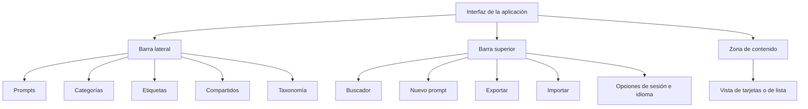
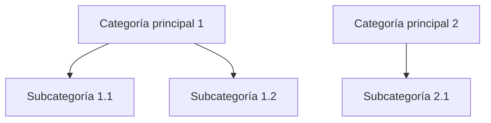

# Manual de usuario — Biblioteca de Prompts

> Aplicación web de gestión y organización de mensajes (prompts) para inteligencia artificial.
> Nombre anterior: «Prompt Database».
> Fecha de creación: 7 de agosto de 2026.

---

## Índice

1. [Parte 1. Introducción](#parte-1-introduccion)
2. [Parte 2. Primeros pasos](#parte-2-primeros-pasos)
3. [Parte 3. Gestión de mensajes](#parte-3-gestion-de-mensajes)
4. [Parte 4. Organización](#parte-4-organizacion)
5. [Parte 5. Búsqueda y filtros](#parte-5-busqueda-y-filtros)
6. [Parte 6. Exportación e importación JSON](#parte-6-exportacion-e-importacion-json)
7. [Parte 7. Perfil y preferencias](#parte-7-perfil-y-preferencias)
8. [Parte 8. Administración](#parte-8-administracion)
9. [Parte 9. Preguntas frecuentes](#parte-9-preguntas-frecuentes)
10. [Fecha de creación y nota de versión](#fecha-de-creacion-y-nota-de-version)

---

## Parte 1. Introducción

### 1.1 Qué es la aplicación

- La Biblioteca de Prompts (antes «Prompt Database») es una aplicación web de gestión y organización de mensajes (prompts) para inteligencia artificial.
- Permite crear, editar, eliminar, buscar y clasificar mensajes desde el navegador, sin instalación local.
- Cada mensaje se guarda con título, descripción, contenido y metadatos de organización.
- La aplicación registra el uso de cada mensaje: número de usos y fecha del último uso.
- Cada usuario dispone de su propio espacio: los mensajes están aislados por usuario.

### 1.2 Para qué sirve

| Necesidad | Solución de la aplicación |
|---|---|
| Reutilizar mensajes | Copia al portapapeles con un clic |
| Encontrar mensajes | Búsqueda de texto completo y filtros |
| Ordenar el contenido | Categorías jerárquicas y etiquetas |
| Compartir trabajo | Mensajes compartidos con vista de solo lectura para otros usuarios |
| Guardar y recuperar datos | Exportación e importación en formato JSON |

### 1.3 A quién va dirigido

- Personas que usan herramientas de inteligencia artificial y desean guardar, ordenar y reutilizar sus mensajes.
- Equipos que trabajan con un banco común de mensajes: la aplicación exige cuenta de usuario y separa el contenido de cada cuenta.
- Administradores: gestionan las cuentas de usuario (crear, activar, desactivar y eliminar).

### 1.4 Tecnología y despliegue

- La aplicación se usa en producción a través del navegador: despliegue en Vercel con base de datos PostgreSQL en Neon.
- No existe entorno local: no es necesario instalar nada en el ordenador.
- Tecnología de la aplicación (referencia):

| Componente | Tecnología |
|---|---|
| Marco de trabajo | Next.js 14 (App Router) |
| Lenguaje de programación | TypeScript |
| Acceso a la base de datos | Prisma |
| Base de datos | PostgreSQL |
| Interfaz de usuario | TailwindCSS y shadcn/ui |

- Idiomas de la interfaz: español e inglés.

---

## Parte 2. Primeros pasos

### 2.1 Acceso a la aplicación

- Abra el navegador.
- Escriba la dirección de la aplicación facilitada por el administrador del servicio (el despliegue de producción se aloja en Vercel).
- La aplicación no requiere instalación ni configuración previa.

### 2.2 Crear una cuenta e iniciar sesión

- Sin sesión iniciada, la barra superior muestra las opciones «Iniciar sesión» y «Registrarse».
- Registro:
  - Haga clic en «Registrarse».
  - Complete los campos: nombre, correo electrónico y contraseña.
  - La contraseña debe tener al menos 6 caracteres.
  - Haga clic en «Registrarse» para crear la cuenta.
- Inicio de sesión:
  - Haga clic en «Iniciar sesión».
  - Introduzca el correo electrónico y la contraseña.
  - Haga clic en «Iniciar sesión».
- Tras varios intentos fallidos, la aplicación puede mostrar el aviso «Demasiados intentos» y bloquear temporalmente el acceso; espere e intente de nuevo más tarde.

### 2.3 Primer vistazo a la interfaz

- Barra lateral: navegación entre Prompts, Categorías, Etiquetas, Compartidos y Taxonomía; se puede contraer y expandir.
- Barra superior: buscador, botón «Nuevo prompt», «Exportar», «Importar» y opciones de sesión e idioma.
- Zona de contenido: mensajes en vista de tarjetas o de lista, con los filtros aplicados.
- Las columnas visibles de la lista y de las tarjetas se configuran en el perfil (véase la Parte 7).

### 2.4 Idioma de la interfaz

- La aplicación ofrece español e inglés.
- La selección se realiza desde el perfil de usuario (véase la Parte 7).
- Existe la opción «Automático (navegador)», que toma el idioma configurado en el navegador.

---

## Parte 3. Gestión de mensajes

### 3.1 Crear un mensaje

- Haga clic en «Nuevo prompt» en la barra superior.
- Complete los campos obligatorios:
  - Título.
  - Contenido del prompt.
- Rellene los campos opcionales: descripción, pre-prompt, manual de uso, metadatos y sección avanzada.
- Haga clic en «Guardar».

### 3.2 Campos del formulario

| Sección | Campo | Descripción |
|---|---|---|
| Información básica | Título | Nombre del mensaje (obligatorio) |
| Información básica | Descripción | Resumen del mensaje |
| Información básica | Contenido del prompt | Texto del mensaje (obligatorio) |
| Información básica | Pre-prompt | Instrucciones previas opcionales |
| Información básica | Manual de uso | Instrucciones de uso opcionales |
| Metadatos | Tipo | Sistema, Usuario o Herramienta |
| Metadatos | Estado | Borrador, Probado o Producción |
| Metadatos | Idioma | Idioma del contenido del mensaje |
| Metadatos | Categorías, Etiquetas, Casos de uso, Cliente/Proyecto, Plataformas, Sugerencias de modelo | Clasificación del mensaje |
| Metadatos | Marcar como favorito | Destaca el mensaje como favorito |
| Avanzado | Versión | Número de versión del mensaje |
| Avanzado | Registro de cambios | Historial de cambios |
| Avanzado | Notas | Notas adicionales |
| Compartido | Compartido | Hace visible el mensaje para otros usuarios |

- La aplicación muestra la fecha de creación y la fecha de actualización del mensaje.

### 3.3 Editar un mensaje

- Localice el mensaje en la lista o en las tarjetas.
- Haga clic en «Editar».
- Modifique los campos necesarios.
- Haga clic en «Guardar».

### 3.4 Eliminar un mensaje

- Localice el mensaje.
- Haga clic en «Eliminar».
- Confirme la eliminación en el aviso «¿Seguro que quieres eliminar este prompt?».
- La acción elimina el mensaje; en la interfaz no figura ninguna opción de deshacer ni de papelera de recuperación.

### 3.5 Duplicar un mensaje

- Localice el mensaje.
- Haga clic en «Duplicar».
- La aplicación crea una copia con el título «{título} (Copia)» y la nota «Duplicado de la versión {versión}».

### 3.6 Copiar un mensaje al portapapeles

- Localice el mensaje.
- Haga clic en «Copiar» (o «Copiar prompt»).
- El contenido del mensaje queda en el portapapeles; la aplicación muestra el aviso «¡Copiado al portapapeles!».
- Al copiar, la aplicación incrementa el contador de usos y actualiza la fecha del último uso.

### 3.7 Favoritos

- Seleccione la opción «Marcar como favorito» en el formulario del mensaje.
- Para mostrar únicamente los favoritos, active «Mostrar solo favoritos» en la barra superior.

### 3.8 Seguimiento de uso

- Cada mensaje muestra el número de usos («uso» o «usos»).
- La fecha del último uso se actualiza automáticamente al copiar el mensaje.
- El seguimiento permite identificar los mensajes más utilizados.

---

## Parte 4. Organización

### 4.1 Categorías jerárquicas

- Las categorías agrupan los mensajes en una estructura de árbol.
- Profundidad máxima: 2 niveles (categoría principal y subcategoría).
- La aplicación impide anidar a más de 2 niveles y lo indica con un aviso.

- Crear una categoría:
  - Desde la barra lateral, abra «Categorías».
  - Haga clic en «Nueva categoría».
  - Complete el nombre (obligatorio) y el slug (identificador único).
  - Seleccione la «Categoría padre» si desea crear una subcategoría (nivel 2).
  - Indique el orden deseado.
  - Haga clic en «Guardar».
- Editar o eliminar una categoría:
  - Use los botones de edición y eliminación de la página «Categorías».
  - Al eliminar una categoría con subcategorías, la aplicación pide confirmación para eliminar también las subcategorías.
  - Los mensajes vinculados a la categoría no se ven afectados.

### 4.2 Etiquetas

- Las etiquetas clasifican los mensajes de forma transversal, sin jerarquía.
- Gestión: desde la barra lateral, abra «Etiquetas».
- «Nueva etiqueta»: nombre (obligatorio) y slug (identificador único).
- Al eliminar una etiqueta, los mensajes que la usan no se ven afectados.

### 4.3 Taxonomía

- La sección «Taxonomía» gestiona los valores de clasificación de los mensajes: tipo, estado, idioma, plataformas, clientes/proyectos, casos de uso y sugerencias de modelo.
- La página de gestión permite crear, editar y eliminar valores («Nuevo valor», «Editar valor»).

| Elemento | Valores disponibles en la aplicación |
|---|---|
| Tipo | Sistema, Usuario, Herramienta |
| Estado | Borrador, Probado, Producción |
| Idioma | Español, Inglés, Francés, Alemán, Italiano, Portugués, Neerlandés, Polaco, Ruso, Japonés, Chino, Coreano, Catalán/Valenciano, Euskara, Gallego y otros |
| Plataformas | Valores definidos por el usuario |
| Cliente / Proyecto | Valores definidos por el usuario |
| Caso de uso | Valores definidos por el usuario |
| Sugerencias de modelo | Valores definidos por el usuario |

### 4.4 Estados de los mensajes

- Borrador: mensaje en elaboración.
- Probado: mensaje comprobado.
- Producción: mensaje en uso habitual.
- El estado se asigna en el formulario del mensaje y se puede utilizar como filtro.

---

## Parte 5. Búsqueda y filtros

### 5.1 Búsqueda de texto completo

- La barra superior incluye el buscador («Buscar prompts...»).
- La búsqueda recorre el título, la descripción y el contenido (cuerpo) de los mensajes.
- Escriba el texto y la lista se actualiza con los resultados.

### 5.2 Filtros

- La aplicación permite filtrar por:
  - Categoría.
  - Etiquetas.
  - Plataforma.
  - Estado.
  - Idioma.
  - Cliente / Proyecto.
  - Caso de uso.
  - Favoritos (opción «Mostrar solo favoritos»).
- Muestre u oculte el panel de filtros con «Mostrar filtros» u «Ocultar filtros».
- El número de filtros activos aparece en la barra superior.
- Use «Limpiar filtros» para retirar todos los filtros de una vez.

### 5.3 Vista de resultados

- Conmutador de vista: «Tarjetas» o «Lista».
- Las columnas visibles y su orden se configuran en el perfil, pestaña «Escritorio».
- La página indica el número de mensajes encontrados.

---

## Parte 6. Exportación e importación JSON

### 6.1 Exportar

- Haga clic en «Exportar» en la barra superior.
- La aplicación descarga un archivo en formato JSON con los mensajes, las categorías y las etiquetas.
- El archivo permite guardar una copia de seguridad del contenido.

### 6.2 Importar

- Haga clic en «Importar» en la barra superior.
- En la ventana «Importar prompts», seleccione un archivo JSON exportado desde esta aplicación.
- Haga clic en «Importar».
- La aplicación muestra «¡Importación realizada con éxito!» al terminar.

### 6.3 Notas

- El formato de importación es propio de la aplicación: únicamente acepta archivos JSON exportados desde esta aplicación.
- Un archivo con formato no válido produce el error «Formato de importación no válido».

---

## Parte 7. Perfil y preferencias

### 7.1 Acceso al perfil

- El perfil se abre desde las opciones de sesión de la barra superior.
- La página «Perfil» gestiona la configuración y las preferencias de la cuenta.

### 7.2 Pestañas del perfil

| Pestaña | Contenido |
|---|---|
| Cuenta | Datos personales, cambio de nombre y cambio de contraseña |
| Escritorio | Preferencias de la interfaz |
| Usuarios | Gestión de usuarios; visible únicamente para el rol administrador (véase la Parte 8) |

### 7.3 Pestaña «Cuenta»

- Muestra el nombre, el correo electrónico y el rol.
- Cambiar nombre:
  - «Cambiar nombre».
  - Escriba el nuevo nombre.
  - «Guardar nombre».
- Cambiar contraseña:
  - «Cambiar contraseña».
  - Introduzca la contraseña actual, la nueva contraseña y la confirmación.
  - La nueva contraseña debe tener al menos 6 caracteres.
  - «Cambiar contraseña» aplica el cambio; la aplicación confirma «Contraseña cambiada correctamente».
- Cerrar sesión: botón «Cerrar sesión».

### 7.4 Pestaña «Escritorio»

| Preferencia | Opciones |
|---|---|
| Idioma | «Automático (navegador)», Español, Inglés; la aplicación anuncia más idiomas próximamente |
| Tema | «Claro» u «Oscuro» |
| Color de la interfaz | Selección de color, con opción de color personalizado en formato hexadecimal |
| Orden de las cajas de filtros | Reordena las cajas de filtros de la página de Prompts |
| Columnas de lista y tarjetas | Elige qué campos se muestran y su orden en las vistas de lista y de tarjetas |

---

## Parte 8. Administración

### 8.1 Acceso

- La gestión de usuarios está reservada al rol administrador.
- El administrador abre la pestaña «Usuarios» desde su perfil.

### 8.2 Funciones de la gestión de usuarios

- Página «Gestión de usuarios»: crea, desactiva o elimina cuentas.
- La lista de usuarios muestra nombre, correo electrónico, rol, estado y fecha de alta.

| Acción | Descripción |
|---|---|
| Nuevo usuario | Crea una cuenta: nombre, correo electrónico, contraseña y rol (Usuario o Administrador) |
| Editar usuario | Modifica los datos de la cuenta |
| Desactivar | Cierra todas las sesiones abiertas e impide iniciar sesión |
| Activar | Restaura el acceso; se restauran todas las sesiones |
| Eliminar usuario | Elimina permanentemente la cuenta y todos sus mensajes; la acción no se puede deshacer |

### 8.3 Reglas de protección

- No se puede eliminar la propia cuenta.
- No se puede desactivar la propia cuenta.
- No se puede desactivar, eliminar ni cambiar el rol del último administrador activo.

---

## Parte 9. Preguntas frecuentes

| Pregunta | Respuesta |
|---|---|
| ¿Necesito instalar algo en mi ordenador? | No. La aplicación se usa desde el navegador; el despliegue de producción se aloja en Vercel con base de datos en Neon. |
| ¿Puedo ver los mensajes de otros usuarios? | No de forma directa: los mensajes están aislados por usuario. Solo ve los mensajes que otros usuarios marcan como compartidos, en la sección «Compartidos», con vista de solo lectura. |
| ¿Cuántos niveles de categorías puedo crear? | Máximo 2 niveles: categoría principal y subcategoría. La aplicación impide anidar a más de 2 niveles. |
| ¿Qué ocurre con mis mensajes si elimino una categoría o una etiqueta? | Nada: los mensajes vinculados no se ven afectados. |
| ¿Puedo recuperar un mensaje eliminado? | En la interfaz no figura ninguna opción de deshacer ni de papelera; no disponemos de información verificada sobre recuperación. |
| ¿Para qué sirve el contador de usos? | Registra cuántas veces se ha copiado el mensaje y la fecha del último uso; se incrementa al copiar el mensaje al portapapeles. |
| ¿Puedo editar los mensajes compartidos por otros usuarios? | No. La vista de mensajes compartidos es de solo lectura. |
| ¿Puedo importar mensajes desde otras aplicaciones? | Solo se aceptan archivos JSON exportados desde esta aplicación. |
| ¿Qué hago si olvido la contraseña? | No disponemos de información verificada sobre un flujo de recuperación de contraseña; contacte con el administrador de la aplicación. |
| ¿Por qué veo el aviso «Demasiados intentos»? | La aplicación limita los intentos de acceso fallidos y bloquea temporalmente la cuenta; espere e intente de nuevo más tarde. |
| ¿Cómo cambio el idioma de la interfaz? | Desde el perfil, pestaña «Escritorio», opción «Idioma»: automático (navegador), español o inglés. |
| ¿Puedo copiar un mensaje con un solo clic? | Sí: el botón «Copiar» copia el contenido al portapapeles con un clic y actualiza el seguimiento de uso. |

---

## Fecha de creación y nota de versión

- Fecha de creación: 7 de agosto de 2026.
- Versión del manual: 1.0.
- Nota de versión: manual inicial, redactado conforme al estado actual de la aplicación en producción (despliegue en Vercel con base de datos PostgreSQL en Neon). La aplicación se denominaba anteriormente «Prompt Database». Cualquier cambio futuro de la aplicación requerirá la actualización de este manual.
